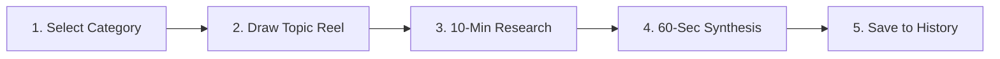

# Ratio — Legal Thinking & Speaking Gym ⚖️

[](https://reactjs.org/)
[](https://www.typescriptlang.org/)
[](https://vitejs.dev/)
[](https://tailwindcss.com/)
[](LICENSE)

> **Think. Research. Speak.**  
> A premium, glassmorphic web application designed for law students, mooters, advocates, and legal scholars to practice rapid legal analysis, structured research, and high-pressure oral advocacy.

---

## 🌟 Overview

**Ratio** is a specialized digital workout gym for legal minds. Named after the foundational legal concept *Ratio Decidendi* ("the legal rationale for a decision"), Ratio trains users to construct coherent, persuasive legal arguments within strict time constraints.

Whether preparing for moot court competitions, judicial services examinations, courtroom advocacy, or oral arguments, Ratio challenges you to draw a random legal concept, conduct focused research, and articulate a 60-second oral synthesis on demand.

---

## ✨ Key Features

### 🎰 1. 3D Slot Machine Topic Reel
- **3-Second Deceleration Reel**: Drawing a topic triggers a 3D slot-machine reel drum animation that rapidly cycles through legal topics and locks onto a chosen concept with a mechanical chime.
- **150+ Curated Legal Topics**: Deep database spanning **17 specialized practice categories**:
  - 🏛️ **Constitutional Law** (Basic Structure, Article 21 Due Process, Writ Jurisdiction, Federalism, Article 44 UCC)
  - 🧠 **Jurisprudence & Legal Theory** (Legal Positivism, Natural Law, Hart-Fuller Debate, Legal Realism, Dworkin)
  - ⚖️ **Landmark Cases & Precedents** (*Kesavananda Bharati*, *Maneka Gandhi*, *Puttaswamy*, *ADM Jabalpur*, *SR Bommai*)
  - 📜 **Statutes & Legislation** (Bharatiya Nyaya Sanhita BNS vs IPC, RTI Act, IBC 2016, DPDP Act 2023, PMLA)
  - 🤝 **Contract Law** (Frustration Sec 56, Promissory Estoppel, Minor Agreements, Smart Contracts)
  - 🛡️ **Law of Torts** (Strict vs Absolute Liability, Vicarious Liability, Defamation, Medical Negligence)
  - ⚖️ **Criminal Law & Criminology** (Culpable Homicide vs Murder, Insanity Defense, Private Defense, Death Penalty)
  - 🏢 **Property Law** (Lis Pendens, Rule Against Perpetuity, Part Performance, Equity of Redemption)
  - 🏛️ **Administrative Law** (Delegated Legislation, Legitimate Expectation, Wednesbury Unreasonableness)
  - 🌐 **International Law** (Sources of Intl Law, UNCLOS, R2P, Diplomatic Immunity, ICJ Jurisdiction)
  - 🕊️ **Human Rights Law** (Non-Refoulement, UDHR, Custodial Torture & DK Basu Guidelines)
  - ⚖️ **Legal Ethics & Responsibility** (Contempt of Court, Advocate Duties, Legal Aid Article 39A)
  - 🧑‍⚖️ **Judicial Institutions & Bench Dynamics** (Collegium vs NJAC, PIL Evolution, Judicial Recusal)
  - 📖 **Legal Maxims** (*Audi Alteram Partem*, *Nemo Judex*, *Res Ipsa Loquitur*, *Actus Reus & Mens Rea*)
  - 🗣️ **Logical Fallacies in Advocacy** (Straw Man, Ad Hominem, Slippery Slope, Red Herring, Circular Reasoning)
  - 📜 **Legal History & Evolution** (Magna Carta, Code of Hammurabi, Constituent Assembly Debates)

### 🎯 2. Category Selection & Practice Filtering
- Filter practice topics by specific categories or practice across **All Categories** simultaneously.
- Dynamically adjusts the random selection pool to target specific areas of study.

### ⭕ 3. Circular Retracting Progress Timer
- **Visual Retracting Ring**: An SVG countdown circle smoothly retracts counter-clockwise as time elapses.
- **Customizable Duration**: Click the circular settings icon to pick preset durations (**3 mins**, **5 mins**, **10 mins**, **15 mins**, **20 mins**) or input custom minutes (1–60 mins).
- **Dynamic Color Phases**: Transitions from Emerald Green (`#10B981`) to Amber Warning (`#F59E0B`) to Red Alert (`#EF4444`).

### 🎙️ 4. 60-Second Oral Synthesis & Speech Studio
- **Micro-Oral Advocacy**: Practice articulating the core legal rationale, statutory provisions, and precedent applications in a 60-second countdown.
- **Audio Recording Studio**: Record voice arguments locally via the browser Web Audio API with active waveform bar visualizers.
- **Auto-Transcription**: Optional speech-to-text engine using Web Speech API to transcribe oral arguments into text.
- **Timer-Only Mode**: Option to practice speaking out loud without requesting microphone permissions.

### 📜 5. Session History & Local IndexedDB Storage
- **Persistent Local Database**: Saves completed sessions locally using IndexedDB (`ratio_db`).
- **Audio Replay & Transcripts**: Play back recorded voice arguments, read auto-generated transcripts, and check exact timestamps (`30 AUG 2026 • 02:15 AM`).
- **Post-Session Save Modal**: Custom glassmorphic prompt asking users whether to save or discard sessions upon completing an argument.
- **In-App Delete Confirmation**: Custom React glassmorphic confirmation modal to safely delete individual saved sessions or clear history.

### 🌙 6. Luxury Glassmorphic Dark Theme
- Modern dark mode aesthetic (`#080C0A`) with glowing emerald accents (`#10B981`), frosted glassmorphic containers (`backdrop-blur-xl`), and Cormorant Garamond serif headings.
- Toggle between Dark and Light modes effortlessly from the header bar.

---

## 🛠️ Technology Stack

- **Frontend Framework**: [React 18](https://reactjs.org/) + [TypeScript](https://www.typescriptlang.org/)
- **Build Tool**: [Vite](https://vitejs.dev/)
- **Styling**: Vanilla CSS Variables + [Tailwind CSS](https://tailwindcss.com/)
- **Iconography**: [Lucide React](https://lucide.dev/)
- **Storage**: IndexedDB (`idb` wrapper) + `localStorage`
- **Audio Processing**: Web Audio API + MediaRecorder API
- **Speech Recognition**: Web Speech API (`webkitSpeechRecognition`)

---

## 🚀 Getting Started

### Prerequisites

Ensure you have **Node.js** (v16+ recommended) and **npm** installed.

```bash
node -v
npm -v
```

### Installation

1. **Clone the Repository**:
   ```bash
   git clone https://github.com/justmayur784/ratio.git
   cd ratio
   ```

2. **Install Dependencies**:
   ```bash
   npm install
   ```

3. **Start Development Server**:
   ```bash
   npm run dev
   ```
   Open [http://localhost:5173](http://localhost:5173) in your web browser.

4. **Build for Production**:
   ```bash
   npm run build
   ```

---

## 🏃 How to Use Ratio



1. **Choose Category**: Select your target practice area (e.g., *Constitutional Law*, *Landmark Cases*, *Maxims*) or choose *All Categories*.
2. **Draw Topic**: Click **DRAW TOPIC** to trigger the 3-second slot machine reel animation that locks onto a random legal concept.
3. **Research Phase**: Use the circular countdown timer (default 10 mins, or customize to 3, 5, 15, 20 mins) to research Bare Acts, SCC Online, Indian Kanoon, or legal commentaries in separate tabs.
4. **Speak & Synthesize**: Click **I'm Ready — Speak Now**. Enable audio recording, start the 60-second timer, and articulate your legal rationale clearly as if advocating before a judge.
5. **Review & Save**: Review your speech-to-text transcript or audio playback, then save the session card to your local History log.

---

## 👨‍💻 Creator Attribution

Created with ❤️ by **Mayur** ([@just.mayur.784](https://www.instagram.com/just.mayur.784?igsi=YXJpemt5bXFpdm93)).

- **Instagram**: [@just.mayur.784](https://www.instagram.com/just.mayur.784?igsi=YXJpemt5bXFpdm93)
- **Project**: Ratio — Legal Thinking & Speaking Gym

---

## 📄 License

This project is licensed under the MIT License - see the [LICENSE](LICENSE) file for details.
